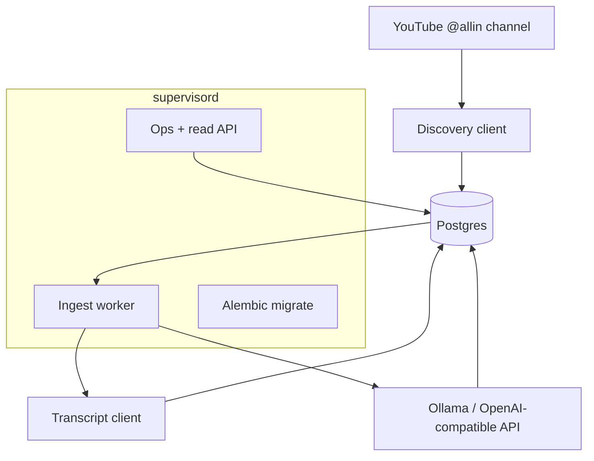

# quant_allinpodcast — Engineering Specification

> **Status:** Proposed
> **Type:** Project specification / initial build issue
> **Reference implementation:** `quant_cnbc` (`mayberryjp/quant_cnbc`)
> **Primary source:** `https://www.youtube.com/@allin`

## 1. Summary

`quant_allinpodcast` is a persistent, supervised Python service that discovers
episodes from the All-In Podcast YouTube channel, retrieves each episode's
transcript, distills it through a local Ollama-compatible API, and persists the
raw transcript plus versioned distilled summaries in PostgreSQL.

The service should intentionally mirror the architecture and operational shape
of `quant_cnbc`: Bottle + waitress API, SQLAlchemy + Alembic persistence,
Docker Compose for local orchestration, and `supervisord` for a long-lived API
+ worker container. The main substitution is the upstream source: YouTube
channel episode discovery + transcript retrieval instead of archive.org TV
items.

This service is a batch-style producer with recovery tooling. It must track
episodes, persist raw transcripts, persist distillations versioned by model and
prompt version, retry failed distills, support reprocessing existing saved
transcripts, and expose a small operational/read API.

## 2. Goals & Non-Goals

### Goals
1. Discover episodes from the All-In Podcast YouTube channel using stable video
   identifiers.
2. Persist episode metadata even before transcript retrieval succeeds.
3. Retrieve and normalize raw transcripts for each episode when captions are
   available.
4. Distill each transcript with a configurable Ollama/OpenAI-compatible LLM
   endpoint.
5. Store both raw transcripts and versioned distilled summaries in PostgreSQL.
6. Retry failed transcript fetch or distill attempts without manual database
   surgery.
7. Support reprocessing saved transcripts when model or prompt versions change.
8. Run as a persistent supervised containerized service using Docker Compose
   and `supervisord`.

### Non-Goals
1. Downloading and transcribing raw audio/video with local ASR in the initial
   version.
2. Generalized entity extraction beyond ticker symbols.
3. Building a public-facing UI.
4. Supporting arbitrary YouTube channels in slice 1; initial scope is the
   All-In channel only, with code structured so other channels are possible
   later.

## 3. Architecture Overview



Processing pipeline per run:

1. Discover recent All-In channel videos and upsert episode records as
   `discovered`.
2. Select actionable rows in states `discovered`, `fetched`, or retryable
   `failed`.
3. Fetch transcript text for `discovered` episodes and persist normalized raw
   transcript text.
4. Distill `fetched` transcripts via the configured Ollama model.
5. Persist the distillation as a versioned row and mark the episode `done`.
6. Record run counters and heartbeat in `ingest_runs`.

## 4. Tech Stack & Conventions

Mirror `quant_cnbc` unless a YouTube-specific need forces a deviation.

| Concern | Choice |
|---|---|
| Language | Python `>=3.11` with Docker base `python:3.12-slim` |
| Web framework | `bottle` served by `waitress` |
| Data layer | `SQLAlchemy>=2.0` + `psycopg[binary]>=3.1` |
| Migrations | `alembic>=1.13` |
| Models / validation | `pydantic>=2.7` + `pydantic-settings>=2.3` |
| HTTP client | `httpx>=0.27` |
| Worker supervision | `supervisord` |
| Local orchestration | `docker compose` |
| Transcript source | YouTube transcript/caption retrieval through a dedicated client abstraction |
| LLM endpoint | Ollama-compatible OpenAI chat/completions API |

### Proposed dependencies (`pyproject.toml`)

```toml
dependencies = [
    "alembic>=1.13",
    "bottle>=0.13.0",
    "psycopg[binary]>=3.1",
    "SQLAlchemy>=2.0",
    "pydantic>=2.7.0",
    "pydantic-settings>=2.3.0",
    "httpx>=0.27",
    "waitress>=3.0",
]

[project.optional-dependencies]
dev = ["pytest>=8.0.0", "webtest>=3.0.0", "respx>=0.21.0"]
```

## 5. Repository Layout

```text
quant_allinpodcast/
├── alembic/
│   ├── env.py
│   └── versions/
│       └── 0001_allin_schema.py
├── app/
│   ├── __init__.py
│   ├── main.py
│   ├── config.py
│   ├── db.py
│   ├── dependencies.py
│   ├── models/
│   │   ├── domain.py
│   │   ├── llm_schemas.py
│   │   ├── requests.py
│   │   └── responses.py
│   ├── repository/
│   │   ├── episodes.py
│   │   ├── distillations.py
│   │   └── runs.py
│   ├── routes/
│   │   ├── health.py
│   │   └── episodes.py
│   └── services/
│       ├── youtube_client.py
│       ├── transcript_fetcher.py
│       ├── llm_client.py
│       ├── distiller.py
│       ├── pipeline.py
│       ├── jobs.py
│       └── ingest_worker.py
├── docs/
│   ├── SPEC.md
│   ├── data_model.md
│   ├── integrations.md
│   └── runbook.md
├── tests/
│   ├── conftest.py
│   └── test_slice*_*.py
├── .env.example
├── Dockerfile
├── docker-compose.yml
├── pyproject.toml
├── README.md
└── supervisord.conf
```

## 6. Data Model (`allin` schema)

### 6.1 `allin.episodes`

Tracks discovery, transcript retrieval, and per-episode processing state.

| Column | Type | Notes |
|---|---|---|
| `id` | BIGSERIAL PK | |
| `video_id` | TEXT NOT NULL UNIQUE | canonical YouTube identifier |
| `channel_slug` | TEXT NOT NULL DEFAULT 'allin' | future-proofing |
| `title` | TEXT | source title |
| `published_at` | TIMESTAMPTZ | YouTube publish timestamp |
| `source_url` | TEXT NOT NULL | `https://www.youtube.com/watch?v=<video_id>` |
| `thumbnail_url` | TEXT | optional |
| `description` | TEXT | optional cached source metadata |
| `duration_seconds` | INT | optional if source provides it |
| `transcript_language` | TEXT | chosen caption language |
| `transcript_source` | TEXT | e.g. `youtube_captions` |
| `content_hash` | TEXT | sha256 of normalized transcript text |
| `raw_text` | TEXT | stored transcript body |
| `status` | TEXT NOT NULL DEFAULT 'discovered' | `discovered | fetched | distilled | done | failed` |
| `attempts` | INT NOT NULL DEFAULT 0 | retry counter |
| `last_error` | TEXT | last failure detail |
| `discovered_at` | TIMESTAMPTZ NOT NULL DEFAULT now() | |
| `fetched_at` | TIMESTAMPTZ | transcript retrieved |
| `distilled_at` | TIMESTAMPTZ | latest successful distill |

Indexes:

1. Unique on `video_id`
2. Unique on `content_hash` where non-null for secondary dedup
3. Index on `(status, published_at desc)`
4. Index on `published_at`

### 6.2 `allin.distillations`

Versioned summaries so a saved transcript can be reprocessed after model or
prompt upgrades.

| Column | Type | Notes |
|---|---|---|
| `id` | BIGSERIAL PK | |
| `episode_id` | BIGINT NOT NULL FK -> `allin.episodes.id` | |
| `model` | TEXT NOT NULL | e.g. `llama3.1:8b` |
| `prompt_version` | TEXT NOT NULL | tracked in config |
| `summary` | TEXT NOT NULL | Markdown summary |
| `key_topics` | JSONB NOT NULL DEFAULT `[]` | list of topics |
| `segments` | JSONB NOT NULL DEFAULT `[]` | per-speaker/per-topic segments |
| `token_usage` | JSONB | provider usage metadata when available |
| `is_current` | BOOLEAN NOT NULL DEFAULT true | latest active version |
| `created_at` | TIMESTAMPTZ NOT NULL DEFAULT now() | |

Constraints / behavior:

1. Unique on `(episode_id, model, prompt_version)`
2. Upsert same `(episode_id, model, prompt_version)`
3. Mark prior rows for the episode `is_current=false` when promoting a new
   current version

### 6.3 `allin.ingest_runs`

Run history and heartbeat.

| Column | Type | Notes |
|---|---|---|
| `run_date` | DATE PK | logical processing date |
| `status` | TEXT NOT NULL | `success | partial | failed` |
| `episodes_discovered` | INT NOT NULL DEFAULT 0 | |
| `transcripts_fetched` | INT NOT NULL DEFAULT 0 | |
| `distilled` | INT NOT NULL DEFAULT 0 | |
| `reprocessed` | INT NOT NULL DEFAULT 0 | |
| `failures` | INT NOT NULL DEFAULT 0 | |
| `last_heartbeat` | TIMESTAMPTZ | worker freshness |
| `notes` | JSONB | optional structured metadata |
| `created_at` | TIMESTAMPTZ NOT NULL DEFAULT now() | |
| `updated_at` | TIMESTAMPTZ NOT NULL DEFAULT now() | |

### State machine

`discovered -> fetched -> distilled -> done`

Any stage failure sets `failed`, stores `last_error`, and increments
`attempts`. Retry flows may restart from `discovered` or reprocess from
`fetched` depending on the operation.

## 7. External Integrations

### 7.1 YouTube channel discovery

The service must discover videos from `https://www.youtube.com/@allin` using a
dedicated `YouTubeClient` abstraction.

Requirements:

1. Stable identity is `video_id`, not title.
2. Discovery should be incremental and idempotent.
3. The client should normalize source metadata into repository upsert payloads.
4. The implementation may use a feed/API/library under the hood, but the rest
   of the app should only depend on `YouTubeClient` methods like
   `discover_recent_videos()` and `fetch_transcript(video_id)`.

### 7.2 Transcript retrieval

Initial version should prefer published YouTube captions/transcripts. If a
video has no transcript available, persist the episode row and mark it failed
with a clear `last_error` so retry sweeps can heal later.

Requirements:

1. Normalize whitespace and speaker markers into a stable text body.
2. Preserve enough structure for later speaker/topic segmentation where
   possible.
3. Compute a `content_hash` over normalized text.
4. Retries on transient HTTP failures must not duplicate rows.

### 7.3 Ollama / local LLM distillation

Use an OpenAI-compatible chat/completions endpoint, defaulting to Ollama.

Pass 1 output schema mirrors `quant_cnbc`:

```json
{
  "summary": "Markdown string",
  "key_topics": ["topic"],
  "segments": [
    {"speaker": "speaker name", "role": "host|guest|null", "summary": "segment summary"}
  ]
}
```

Rules:

1. The model returns structured JSON; application code only validates and does
   light shape recovery.
2. Long transcripts use map/reduce chunking, mirroring `quant_cnbc`.
3. Distillation is version-scoped by `model + prompt_version`.
4. A thin or malformed reduce result should fall back to merged map-stage
   partials instead of failing the item unnecessarily.

## 8. Configuration (`.env`)

Use `pydantic-settings` with `env_prefix="ALLIN_"`; keep `DATABASE_URL` and
`API_PORT` unprefixed to match sibling service conventions.

```dotenv
# Postgres
DATABASE_URL=postgresql+psycopg://quant:quant_dev_password@db:5432/quant

# API
API_LISTEN_ADDRESS=0.0.0.0
API_PORT=8020

# Worker cadence
ALLIN_INGEST_WAKE_TIME=06:00
ALLIN_INGEST_INTERVAL=86400
ALLIN_INGEST_INTERVAL_HOURS=4
ALLIN_LOOKBACK_DAYS=14
ALLIN_MAX_ATTEMPTS=5
ALLIN_FAILED_RETRY_INTERVAL_HOURS=6
ALLIN_FAILED_RETRY_DELETE_ATTEMPTS=10

# Source
ALLIN_CHANNEL_URL=https://www.youtube.com/@allin
ALLIN_CHANNEL_SLUG=allin
ALLIN_TRANSCRIPT_LANGUAGES=en,en-US

# LLM
ALLIN_LLM_BASE_URL=http://ollama:11434/v1
ALLIN_LLM_MODEL=llama3.1:8b
ALLIN_LLM_API_KEY=
ALLIN_LLM_TIMEOUT=120
ALLIN_LLM_JSON_MODE=true
ALLIN_LLM_NUM_CTX=8192
ALLIN_LLM_MAX_TOKENS=4096
ALLIN_DISTILL_PROMPT_VERSION=v1
ALLIN_DISTILL_MAX_CHUNK_CHARS=12000

# Resilience
ALLIN_HTTP_RETRIES=3
ALLIN_RETRY_BACKOFF=1.0
```

## 9. HTTP API

Small operational and read API, mirroring `quant_cnbc` patterns.

| Method | Path | Description |
|---|---|---|
| GET | `/allin/health` | Liveness |
| GET | `/allin/ready` | DB reachable + recent worker heartbeat |
| GET | `/allin/stats` | counters + last run summary |
| GET | `/episodes` | list episodes with current summary excerpt/metrics |
| GET | `/episodes/{id}` | episode metadata + raw transcript + current distillation |
| POST | `/episodes/{video_id}/reprocess` | re-run distillation from saved raw transcript |
| POST | `/episodes/{video_id}/restart` | re-fetch transcript then re-distill |
| POST | `/reprocess` | bulk reprocess saved transcripts |
| POST | `/retry-failed` | retry failed items in background |
| POST | `/runs/trigger` | manually trigger a run |
| GET | `/jobs/{id}` | in-process background job status |

Notes:

1. Long-running operations execute in background daemon threads via an
   in-process job registry, matching the reference repo.
2. Read endpoints should expose scalar metrics like raw transcript length,
   summary length, topic count, segment count, attempt count, and last error.

## 10. Worker, Docker Compose, and `supervisord`

The container should run three supervised processes:

1. `alembic upgrade head`
2. `python -m app.main`
3. `python -m app.services.ingest_worker --wake-time %(ENV_ALLIN_INGEST_WAKE_TIME)s`

### `supervisord.conf` (proposed)

```ini
[supervisord]
nodaemon=true
logfile=/var/log/supervisord.log
loglevel=info

[program:alembic-migrate]
command=alembic upgrade head
directory=/app
autostart=true
autorestart=false
startsecs=0
exitcodes=0
priority=10
environment=PYTHONUNBUFFERED="1"

[program:allin-api]
command=bash -c "sleep 5 && exec python3 -m app.main"
directory=/app
autostart=true
autorestart=true
startretries=999
startsecs=5
priority=20
environment=PYTHONUNBUFFERED="1"

[program:allin-ingest-worker]
command=bash -c "sleep 5 && exec python3 -m app.services.ingest_worker --wake-time %(ENV_ALLIN_INGEST_WAKE_TIME)s"
directory=/app
autostart=true
autorestart=true
startretries=999
startsecs=5
priority=30
environment=PYTHONUNBUFFERED="1"
```

### `Dockerfile` (proposed)

```dockerfile
FROM python:3.12-slim

ENV PYTHONDONTWRITEBYTECODE=1 \
    PYTHONUNBUFFERED=1 \
    PIP_NO_CACHE_DIR=1

WORKDIR /app

RUN apt-get update \
    && apt-get install -y --no-install-recommends bash ca-certificates git vim procps \
    && rm -rf /var/lib/apt/lists/*

COPY . /app

RUN python3 -m pip install --upgrade pip \
    && python3 -m pip install -e ".[dev]" \
    && python3 -m pip install supervisor

CMD ["supervisord", "-c", "/app/supervisord.conf"]
```

### `docker-compose.yml` (proposed)

Services:

1. `db` — Postgres with persistent volume
2. `app` — this repo, exposing API port `8020`
3. Optional `ollama` — local Ollama container for development

Compose requirements:

1. `.env`-driven configuration
2. `app` depends on `db`
3. Named volumes for Postgres data and optional Ollama model cache

## 11. Idempotency, Dedup, and Error Handling

1. Discovery upserts by `video_id`.
2. Transcript-level secondary dedup uses `content_hash`.
3. Transient source or LLM failures set status `failed`, store `last_error`,
   increment `attempts`, and never crash the whole run.
4. `retry-failed` restarts failed rows through the full pipeline.
5. `reprocess` re-runs distillation from saved `raw_text` without refetching.
6. Rows exceeding a configurable failure threshold may be deleted during retry
   sweeps to avoid endless churn, matching the reference repo behavior.
7. Run status is `partial` if any per-item failure occurs but the batch
   continues.

## 12. Development Plan — Vertical Slices

Each slice should ship end-to-end with its own test file.

| Slice | Deliverable | Acceptance |
|---|---|---|
| **0** | Scaffold: `pyproject`, config, DB wiring, Bottle app, `/allin/health`, Alembic baseline, Docker/supervisord skeleton | `pytest` green; health returns `{"status":"ok"}` |
| **1** | Postgres `allin` schema migration + domain models + repositories | migration applies; repository CRUD round-trips |
| **2** | YouTube episode discovery + dedup + persist discovered episodes | mocked source persists unique `video_id` rows |
| **3** | Transcript fetch + normalization + raw transcript persistence | mocked transcript retrieval stores `raw_text`, `content_hash`, `fetched_at` |
| **4** | LLM distillation + versioned persistence | mocked Ollama JSON output validates and persists current distillation |
| **5** | Worker pipeline state machine + ingest run heartbeat | `--once` completes a batch and writes counters |
| **6** | Failed-item retry + restart + reprocess semantics | retry/restart/reprocess paths work and preserve idempotency |
| **7** | Read/ops API: `/ready`, `/stats`, `/episodes`, `/jobs` | endpoints return expected shapes with metrics |
| **8** | Docker Compose + supervisord finalization + runbook/docs | `docker compose up` boots successfully and runs migrations |
| **9** | Hardening: map/reduce fallback, malformed JSON recovery, retry policy tuning | resilience tests green |

## 13. Testing Strategy

1. Unit tests for config parsing, repository state transitions, dedup, and
   prompt-version behavior.
2. HTTP client tests using mocked YouTube/transcript/LLM responses.
3. Pipeline tests with injected fake repositories and fake clients, mirroring
   the reference repo style.
4. API tests with WebTest for list/detail/retry endpoints.
5. Distiller tests for single-shot, map/reduce, malformed output recovery, and
   thin-reduce fallback.

## 14. Definition of Done

1. All slices merged with green tests.
2. `docker compose up` starts Postgres and the supervised app container.
3. The worker discovers All-In episodes, stores episode metadata, stores raw
   transcripts, and stores current distillations.
4. Failed rows can be retried via worker CLI or HTTP endpoint.
5. Saved transcripts can be reprocessed after a model or prompt upgrade without
   re-fetching.
6. `README.md`, `docs/data_model.md`, `docs/integrations.md`, and
   `docs/runbook.md` document operation and recovery.

## 15. Open Questions

1. Which transcript acquisition mechanism should be the default implementation:
   official captions via a library, YouTube page extraction, or another API?
2. Should episodes with no published captions remain failed indefinitely,
   auto-delete after a threshold, or be marked as permanently unavailable?
3. Should we maintain one summary per episode only, or preserve multiple
   distillations as current/non-current versions from day one? This spec assumes
   versioned distillations from the start to match `quant_cnbc`.
